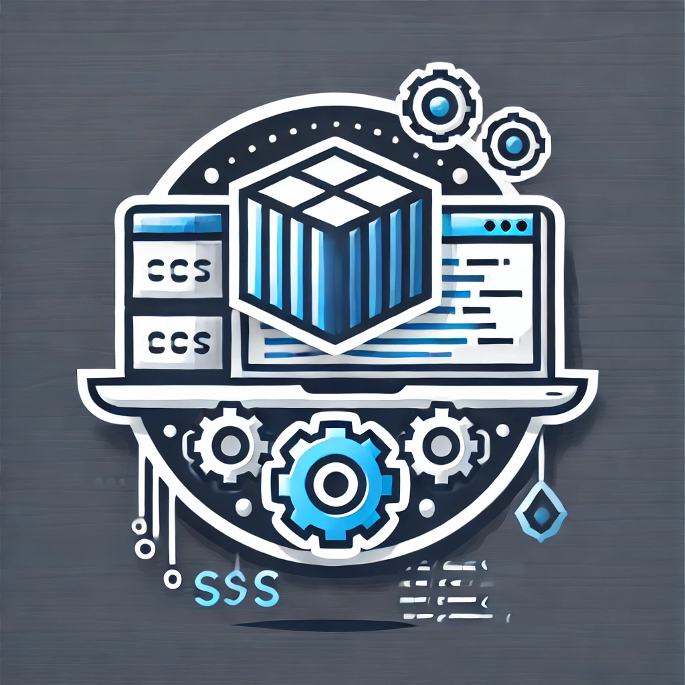

### **Developer Environment Container Description**

This Docker container is designed to serve as a development environment where you can easily develop and run various types of applications (e.g., web, Node.js, Python, Java, etc.) with all necessary tools and dependencies pre-installed. It is optimized to be used for both general development purposes and as a base for running multi-service applications (e.g., web servers, databases, Jenkins).

#### **Key Features:**
1. **Base Image**: The container is based on the latest `ubuntu` image to provide a clean, minimal Linux environment that can be customized with necessary tools and software.

2. **Pre-Installed Software**:
    - **OpenJDK**: The container includes the latest version of OpenJDK for Java development.
    - **Python**: A Python environment with tools like `pip` and `virtualenv` for managing Python packages and creating virtual environments.
    - **Node.js and NPM**: Installed for JavaScript and Node.js development, including popular tools like `npm` and `angular-cli`.
    - **Git**: To allow easy cloning of repositories and version control.
    - **Docker**: Docker is installed to enable building and managing Docker containers from within the container, allowing for a seamless DevOps experience.
    - **Virtualenv**: For creating isolated Python environments, ensuring that dependencies don't conflict with system-wide packages.

3. **Volumes**:
    - The container has a mapped volume to the `./workspace` directory on the host machine, where all your application code can be stored and accessed seamlessly.
    - The Docker socket (`/var/run/docker.sock`) is mounted inside the container to allow Docker commands to be run from within the container, facilitating the development of Docker-based applications.

4. **Ports**:
    - **8080**: Exposes port 8080 for web applications.
    - **3000**: Exposes port 3000 for Node.js-based applications (e.g., React apps).
    - **5000**: Exposes port 5000 for Python-based applications (e.g., Flask or Django apps).
  
5. **MySQL Integration**: This container is linked to a MySQL container, which can be used for developing database-driven applications. The MySQL container is configured with default environment variables for easy access.

6. **Jenkins**: The container is integrated with Jenkins for CI/CD workflows. Jenkins is exposed on port 8082 and can be accessed for automating builds, deployments, and tests.

#### **Development Use-Cases:**
- **Web Applications**: Build and run web applications using a variety of technologies such as Node.js, Python, or Java.
- **CI/CD Pipeline**: Use Jenkins for automating builds, testing, and deployment of applications.
- **Database-Driven Applications**: Develop applications that connect to MySQL and other services in the Docker Compose setup.
- **Multi-Service Environments**: Manage complex environments with multiple interconnected services (e.g., web servers, databases, etc.).

#### **How to Use**:
1. **Clone this Repository**: Clone this project to your local machine and navigate to the project directory.
2. **Build and Start the Containers**: Run `docker-compose up --build` to build and start the container along with any other defined services (e.g., MySQL, Jenkins).
3. **Access Services**: 
   - For Jenkins: Access via `http://localhost:8082`.
   - For the application services: Access them based on the exposed ports (`8080`, `3000`, `5000`).
4. **Develop your Application**: Start developing your application inside the `./workspace` directory and use the pre-installed tools and services for building, testing, and deployment.

#### **Customizations**:
- You can modify the `Dockerfile` or `docker-compose.yml` file to include additional tools or change the configuration to suit your needs.

#### **Why Use This Container**:
This container simplifies the process of setting up a development environment with all necessary dependencies for web, Node.js, Python, Java, and other services. It reduces the friction of environment setup and makes it easier to focus on developing applications.

